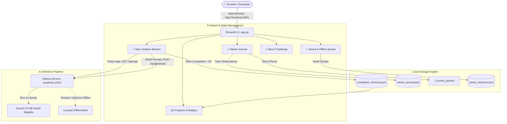

# 🌿 NatureQuest-AI

> **Hacktoberfest 2026 Touch Grass Challenge Entry**  
> A responsive, privacy-first web application that empowers students, developers, and tech creators to disconnect from screen fatigue and reconnect with the living world through personalized, local AI-guided nature missions, gamified habit tracking, and mindful field journaling.

---

## 📖 Overview & Problem Statement

### The Problem: Cognitive Fatigue & Digital Burnout
Modern software developers, students, and technology professionals spend up to 10–14 hours daily glued to high-refresh-rate monitors. Late-night debugging sessions, endless issue queues, and notification overload trigger chronic cognitive fatigue, shallow breathing, and attention depletion. Environmental psychology and attention restoration theory (ART) show that just 15–30 minutes of intentional nature exposure significantly reduces salivary cortisol, restores executive focus, and recalibrates human sensory awareness.

Yet, when told to *"go outside and touch grass"*, people often face friction:
- *What should I actually do outside?*
- *I only have 15 minutes between lectures or meetings.*
- *I don't have access to a national park, only a campus quad or street canopy.*

### The Solution: NatureQuest-AI
**NatureQuest-AI** transforms the outdoor world into an engaging, low-barrier quest log. Rather than vague advice, it synthesizes your available time (15–60 mins), activity preference, difficulty level, outdoor setting, and current headspace into a structured, mindful field mission. Every quest provides:
1. A **concrete objective**
2. A **clear rationale** explaining why the activity restores cognitive focus
3. **3–5 actionable steps** with interactive checkboxes
4. A **packing checklist**
5. **Leave No Trace (LNT)** environmental stewardship reminders

---

## 🌟 Core Features

### 1. 🤖 Local AI Mission Generation
* **Powered by Local Ollama & Qwen2.5 0.5B:** Communicates directly with your local Ollama daemon via `http://localhost:11434/api/generate` using structured JSON mode (`format: "json"`).
* **Deeply Personalized Quests:** Generates unique missions based on:
  * **Activity:** Walking & Urban Trekking, Birdwatching & Wildlife, Gardening & Plant Care, Nature Photography & Macro Scouting.
  * **Duration:** 15, 30, 45, or 60 minutes.
  * **Difficulty:** Easy, Medium, or Challenging.
  * **Setting:** Campus Quad, Neighborhood Park, Backyard / Balcony Garden, Forest Trail, or Urban Street Canopy.
  * **Goal:** Mindful Wind-Down & Stress Relief, Active Exploration & Discovery, or Creative Focus & Scouting.
* **Rigorous Validation & Fallback:** Validates schema integrity, ensures 3–5 actionable steps, and gracefully handles connection drops or timeouts by switching to curated missions with transparent labelling.

### 2. 🏆 Gamification & Anti-Duplicate XP System
* **XP Awarded Only on Completion:** Earn XP solely by completing real outdoor quests. XP scales with duration and difficulty, plus an extra bonus for on-device local AI generation.
* **Anti-Duplicate Reward Prevention:** Unique mission fingerprinting prevents accidental duplicate completions and blocks duplicate XP rewards for the same quest.
* **6 Explorer Ranks:** Level up from **Sprout Scout** (Lvl 1) through **Trail Walker**, **Canopy Explorer**, **Forest Ranger**, **Wilderness Guide**, to **Master Naturalist** (Lvl 6) with real-time level progress bars.
* **Active Daily Streak (🔥):** Automatically calculated from actual `completed_at` calendar dates.
* **10 Verifiable Badges:** Earn achievements based strictly on verified user activity (e.g. *First Footprint*, *Trail Strider*, *Avian Observer*, *Green Thumb*, *Hour in the Wild*, *Consistency Flame*, *Field Scribe*).

### 3. 📝 Nature Journal (Privacy-First)
* **Mindful Field Observations:** Record field notes, sensory observations, and dates.
* **Optional Field Photos:** Attach `.jpg`, `.png`, or `.webp` field photos, saved locally to the `journal_photos/` directory.
* **Zero Precise Location Tracking:** Respects privacy by design. The app never queries GPS coordinates, browser geolocation APIs, or IP addresses. Users select broad category settings only.
* **Auto-Journal Integration:** Optionally copy your post-mission reflection directly into the field journal upon completing a quest.

### 4. 📊 Progress Dashboard
* **Verified Data Only:** Displays genuine metrics computed dynamically from local storage: completed quests, total outdoor minutes, XP, rank, and active daily streak.
* **Weekly Activity Bar Chart:** Visualizes cumulative outdoor minutes logged each day over the past 7 calendar days.
* **Achievement Showcase:** Visual badge grid showing unlocked status and unlock criteria.
* **Mission History Logbook:** Expandable archive of completed quests with student reflection notes and logbook clearing controls.

### 5. 💾 Saved & Offline Quests
* **Mission Stash:** Stash generated quests into `saved_missions.json` so they remain ready to complete outdoors even when offline.
* **Instant Offline Generator:** Create rich handcrafted missions immediately from the local bank with zero network or AI dependencies.
* **Transparent Source Badges:** Every mission clearly states its origin: `🤖 Ollama Local AI (qwen2.5:0.5b)`, `💾 Saved Offline Quest`, or `🍂 Curated Offline Fallback Mode`.

---

## 🛠️ Tech Stack

| Component | Technology | Rationale |
| :--- | :--- | :--- |
| **Language** | Python 3.10+ | Clean syntax, robust standard library, cross-platform support |
| **Web Framework** | [Streamlit](https://streamlit.io/) | Interactive UI, reactive state management, zero frontend boilerplate |
| **Local AI Engine** | [Ollama](https://ollama.com) | Standalone on-device LLM runner exposing clean REST APIs (`/api/tags`, `/api/generate`) |
| **Language Model** | [Qwen2.5 0.5B](https://ollama.com/library/qwen2.5:0.5b) | Ultra-lightweight open-weight model with strong JSON instruction-following and minimal RAM/VRAM footprint |
| **Styling** | Vanilla CSS + Streamlit Theming | Custom responsive cards, badges, and typography (*Plus Jakarta Sans*, forest green and warm amber palette) |
| **Image Processing** | [Pillow](https://python-pillow.org/) | Local validation and storage of journal field photos |
| **Persistence** | Local JSON Files (`.gitignore`'d) | Zero external database overhead; lightweight, transparent, and completely portable |

---

## 🏛️ Architecture



---

## 🌐 Local AI & Offline Readiness Explained

Understanding how offline functionality works in NatureQuest-AI:

> [!IMPORTANT]
> **Ollama must be running locally** (`http://localhost:11434`) for real-time AI generation.

* **When Ollama and `qwen2.5:0.5b` are installed locally:**
  Inference is executed **100% on your device**. No internet connection or cloud API keys are required. You can sit on a campus bench without Wi-Fi and generate unique missions.
* **When Ollama is offline or not installed:**
  The app detects this instantly via the `/api/tags` health check and seamlessly runs in **Curated Offline Fallback Mode**. Handcrafted missions remain accessible with zero degradation in UI experience.
* **Saved / Stashed Missions & Nature Journal:**
  Previously generated quests and field observations are stored directly in local JSON files on your hard drive. They are always accessible regardless of network or Ollama availability.

---

## 💡 Why Open-Source AI & Open-Weight Models Matter

NatureQuest-AI intentionally uses **Qwen2.5 0.5B** via **Ollama** rather than commercial cloud APIs (such as OpenAI or Anthropic):

1. **Complete Mental Health & Reflection Privacy:**
   Students record personal reflections, stress levels, and schedules. With local open-weight models, this data never leaves your laptop. No prompts or notes are uploaded to third-party cloud servers or used for model training.
2. **Zero Cost & Zero Barriers:**
   Students should not need credit cards, paid API subscriptions, or API token budgets just to take a break from their screens.
3. **True Offline Independence:**
   Disconnecting from the internet is at the core of the *Touch Grass* philosophy. A tool designed to get you away from screens should not depend on a cloud connection to function.
4. **Accessible Compute Requirements:**
   At only ~500 million parameters (~400 MB download), Qwen2.5 0.5B runs smoothly on modest student laptops with CPU-only inference, consuming negligible battery and memory.

---

## 🚀 Step-by-Step Installation & Setup (Windows)

Follow these exact steps in **Windows PowerShell**:

### 1. Prerequisites
* **Python 3.10+**: Download and install from [python.org](https://www.python.org/downloads/). *(Be sure to check "Add python.exe to PATH" during installation).*
* **Ollama for Windows**: Download and install from [ollama.com/download](https://ollama.com/download/windows).

---

### 2. Clone the Repository & Open Project Directory

```powershell
git clone https://github.com/prathmeshvaidya789-svg/NatureQuest-AI.git
cd NatureQuest-AI
```

---

### 3. Create & Activate Virtual Environment

```powershell
# Create virtual environment
python -m venv .venv

# If script execution is restricted on your system, enable it for this process:
Set-ExecutionPolicy -Scope Process -ExecutionPolicy Bypass

# Activate the virtual environment
.\.venv\Scripts\Activate.ps1
```

---

### 4. Install Dependencies

```powershell
pip install --upgrade pip
pip install -r requirements.txt
```

---

### 5. Pull & Start the AI Model

In your terminal, pull and test the lightweight model:

```powershell
ollama run qwen2.5:0.5b
```

*(Once the model finishes downloading, you can type `/bye` to exit the chat prompt. The Ollama background daemon will remain active and listening at `http://localhost:11434`).*

---

### 6. Run the Application

Launch the Streamlit web application:

```powershell
streamlit run app.py
```

The web application will open automatically in your browser at:
👉 **`http://localhost:8501`**

---

## 🖼️ Application Walkthrough & Visual Tour

*(Screenshots can be added to the `docs/screenshots/` folder)*

| View | Description | Preview |
| :--- | :--- | :--- |
| **New Mission Briefing** | Select activity, duration, difficulty, setting, and goal to receive an AI-crafted quest with objective, actionable checklist, gear, and Leave No Trace reminders. | `[docs/screenshots/01_mission_briefing.png]` |
| **Nature Journal** | Log sensory observations and attach optional field photos without transmitting precision GPS coordinates. | `[docs/screenshots/02_nature_journal.png]` |
| **Progress Dashboard** | Track total missions, outdoor minutes, weekly activity bar chart, XP, explorer rank, and earned badges. | `[docs/screenshots/03_progress_dashboard.png]` |
| **Saved & Offline Quests** | Browse your stashed offline missions or generate an instant curated quest without internet or AI. | `[docs/screenshots/04_offline_quests.png]` |

---

## 🧪 Testing & Verification

The project includes an end-to-end integration test suite powered by Streamlit's `AppTest` framework that validates all core user flows:

```powershell
# Run the test suite using your virtual environment:
.\.venv\Scripts\python.exe -m unittest discover -s . -p "test_*.py"
# Or run the included test script:
.\.venv\Scripts\python.exe scratch/test_upgraded_app.py
```

### Verified User Flows:
- ✅ **Sidebar Daemon Health Check:** Confirms `GET /api/tags` returns `200 OK` and model `qwen2.5:0.5b` is ready.
- ✅ **AI Generation & Schema Validation:** Confirms `POST /api/generate` outputs valid JSON with title, objective, 3–5 steps, gear, safety tips, and outdoor rationale.
- ✅ **Gamification & Duplicate Prevention:** Confirms XP is awarded upon completion and subsequent attempts on the same mission are rejected.
- ✅ **Nature Journal Storage:** Confirms observations persist to `nature_journal.json` and photos save to `journal_photos/` without location tracking.
- ✅ **Progress Metrics Calculation:** Confirms accurate streak, level progression, and 7-day activity grouping based on actual saved dates.
- ✅ **Offline Fallback Simulation:** Confirms seamless transition to Curated Fallback Mode when the Ollama host is unreachable.

---

## ⚠️ Known Limitations

1. **Single-Device Local Persistence:** Progress, journal notes, and photos are stored locally on your machine in JSON files and `journal_photos/`. They do not sync across different devices or browsers.
2. **Compact Model Nuances:** While Qwen2.5 0.5B is fast and capable, smaller models occasionally produce minor phrasing repetitions. The built-in validator ([validate_and_sanitize_mission](file:///c:/Users/user/OneDrive/Desktop/NatureQuest-AI/app.py)) enforces fallback structures when outputs diverge from the schema.
3. **Local Daemon Prerequisite for AI:** If the Ollama background daemon is terminated or your laptop reboots, the AI generation switches to curated mode until `ollama serve` or `ollama run qwen2.5:0.5b` is started.

---

## 🔮 Future Improvements

- [ ] **Native Audio Ambience:** Add local, relaxing ambient soundscapes (gentle rain, birdsong, rustling leaves) during active outdoor timers.
- [ ] **Field Guide PDF Export:** Allow students to export their completed nature journal and photo logbook into a printable PDF scrapbook.
- [ ] **On-Device Plant & Wildlife Vision:** Integrate local lightweight vision models (e.g., MobileNet or Moondream) for offline leaf and bird identification.
- [ ] **Desktop Notification Reminders:** Optional system tray notifications nudging users when they have been typing continuously for 90 minutes.

---

## 🛡️ Outdoor Ethics: Leave No Trace (LNT)

Every NatureQuest-AI mission reinforces the core principles of outdoor stewardship:
1. **Plan ahead and prepare.**
2. **Travel and walk on durable surfaces.**
3. **Dispose of waste properly (pack it in, pack it out).**
4. **Leave what you find (rocks, plants, artifacts).**
5. **Respect wildlife from a safe distance.**
6. **Be considerate of other outdoor visitors.**

---

## 📄 License & Hacktoberfest Note

Created for the **Hacktoberfest 2026 Touch Grass Challenge**. Distributed under the [MIT License](LICENSE).
